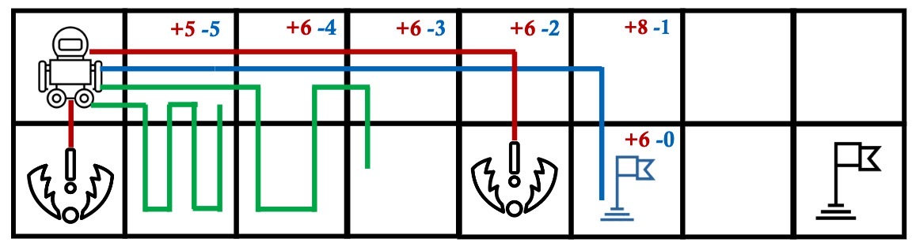

# Safe Goal-Oriented Reinforcement Learning On Navigation (SGORLON)

  
   
   

This is `pytorch` and `tensorflow` implementations of SGORLON model using HER and HGG as the backbone. This is the experimental code in the following work:

> Goal-oriented Reinforcement Learning for Navigation in Safety-Critical Environments  
Jiarui Jin, Song Ma, Yali Du, Jun Wang, Yuanchang Liu  
